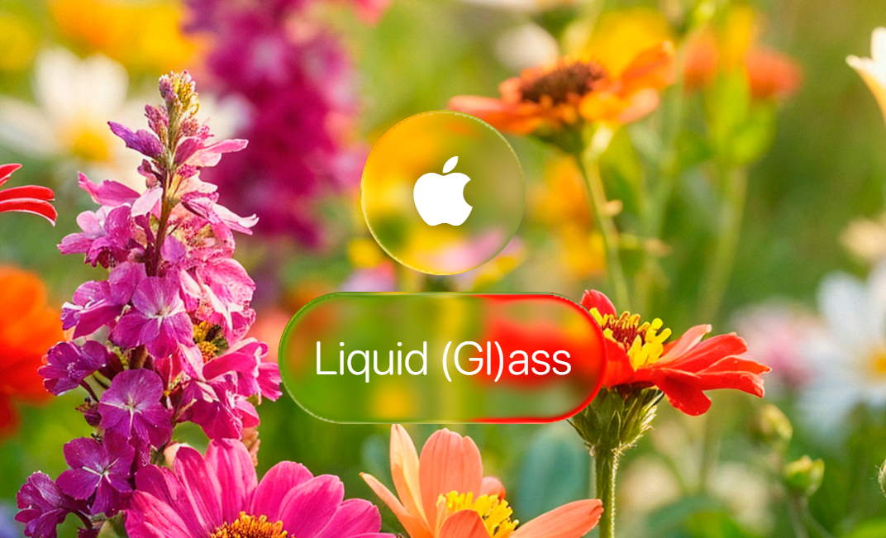
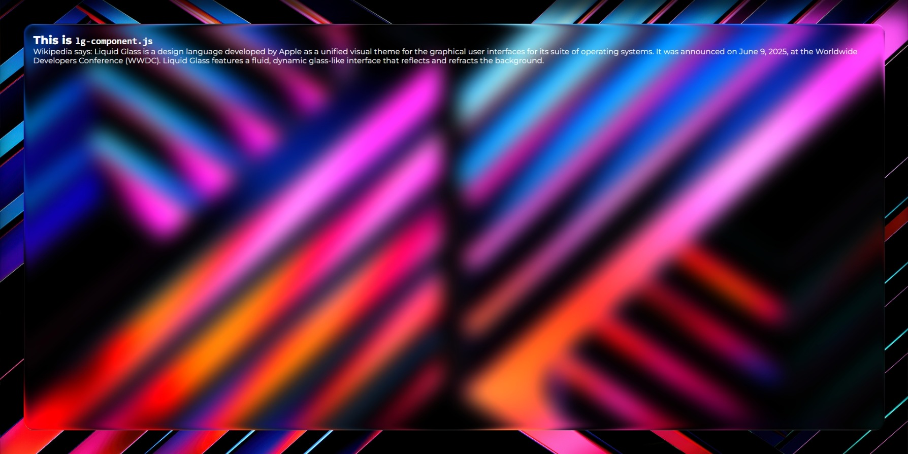
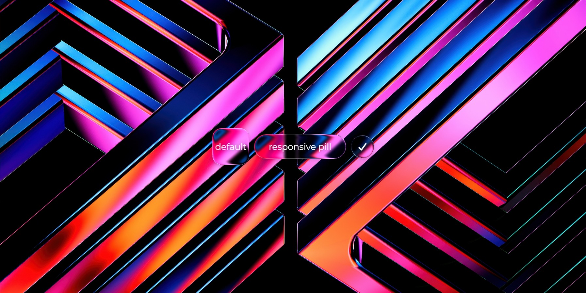
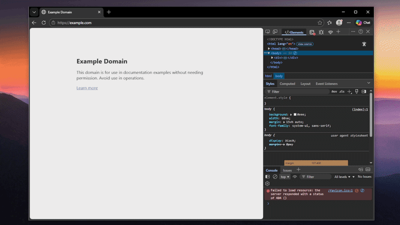
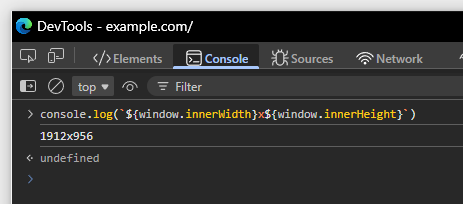

# Liquid (Gl)ass in HTML/CSS/JS



First off, I want to give credits to [@kube](https://github.com/kube) for the original [React TS implementation](https://github.com/kube/kube.io/tree/main/app/data/articles/2025_10_04_liquid_glass_css_svg) of his [Liquid Glass article](https://kube.io/blog/liquid-glass-css-svg). Without it, this wouldn't have existed!

I made this project with the goal of making [@kube](https://github.com/kube)'s Liquid Glass demonstration actually distributable and usable. Keep in mind that this isn't perfect, so funny stuff or whatnot could happen. PRs are welcome though!

**[My personal website](https://winaviation.github.io)** is a pretty big usage example of this project.

# Usage

> [!CAUTION]
> The guide below AND the components are largely incomplete especially mobile layout stuff, need an extra JS to make it work good, visit [my website's source](https://github.com/winaviation/winaviation.github.io) to see how I implemented it.
>
> Though, the guide should be able to let you know the basics on the usage.

> [!WARNING]
> On non-Chromium browsers, a fallback blur will be used instead. As of now, the only browser engine that supports using SVG displacement maps in `backdrop-filter` is Blink (Chromium browsers).
>
> Although there is a hacky workaround to this by using `filter`, it is heavy on the GPU and adds complexity. I tried to do so in [liquid-glass-demo](https://github.com/winaviation/liquid-glass-demo) but I won't implement it here for now.

## Components

> [!NOTE]
> Configurable using HTML attributes.

### `lg-component.js` (`<liquid-glass>`)

- Non-interactive Liquid Glass container element with customizable glass effects.

<details>
<summary>Example usage:</summary>

```html
<!doctype html>
<html>
  <head>
    <style>
      @import url("https://fonts.googleapis.com/css2?family=Montserrat:ital,wght@0,100..900;1,100..900&display=swap");
      * {
        font-family: "Montserrat";
        margin: 0;
        padding: 0;
        user-select: none;
        -webkit-user-select: none;
      }
      body {
        min-height: 100vh;
        overflow: hidden;
        background: url("background.jpg") no-repeat center center;
        background-size: cover;
        box-shadow: inset 0 40px 40px -10px rgba(0, 0, 0, 0.8);
        color: white;
      }
      h2 {
        font-weight: 800;
        letter-spacing: 0.01rem;
      }
      code {
        font-family: monospace;
      }
      p {
        letter-spacing: 0.01rem;
      }
      main {
        display: flex;
        justify-content: center;
        align-items: center;
        min-height: 100vh;
      }
      .liquid-content {
        padding: 20px;
      }
    </style>
  </head>
  <body>
    <main>
      <liquid-glass
        flex-center="false"
        responsive="true"
        vw-width="94.8"
        vh-height="89.5"
        radius-percent="2.3"
        bezel-width-percent="2.3"
        fallback-blur="25"
        blur="20"
        specular-opacity="0.5"
      >
        <div class="liquid-content">
          <h2>This is <code>lg-component.js</code></h2>
          <p>
            Wikipedia says: Liquid Glass is a design language developed by Apple
            as a unified visual theme for the graphical user interfaces for its
            suite of operating systems. It was announced on June 9, 2025, at the
            Worldwide Developers Conference (WWDC). Liquid Glass features a
            fluid, dynamic glass-like interface that reflects and refracts the
            background.
          </p>
        </div>
      </liquid-glass>
    </main>
    <script type="module" src="lg-component.js"></script>
  </body>
</html>
```


</details>

### `lg-button-component.js` (`<liquid-btn>`)

- Interactive Liquid Glass button element with spring-physics hover and press animations.

<details>
<summary>Example usage:</summary>

```html
<!doctype html>
<html>
  <head>
    <style>
      @import url("https://fonts.googleapis.com/css2?family=Montserrat:ital,wght@0,100..900;1,100..900&display=swap");
      * {
        font-family: "Montserrat";
        margin: 0;
        padding: 0;
        user-select: none;
        -webkit-user-select: none;
      }
      body {
        min-height: 100vh;
        overflow: hidden;
        background: url("background.jpg") no-repeat center center;
        background-size: cover;
        color: white;
        display: flex;
        justify-content: center;
        align-items: center;
        gap: 16px;
      }
    </style>
    <script
      src="https://kit.fontawesome.com/6c5929dddf.js"
      crossorigin="anonymous"
    ></script>
  </head>
  <body>
    <liquid-btn>default</liquid-btn>
    <liquid-btn
      type="pill"
      responsive="true"
      vh-height="8.4"
      vw-width="15.7"
      bezel-width-percent="25"
      >responsive pill</liquid-btn
    >
    <liquid-btn
      type="circle"
      width="75"
      surface-type="convex_circle"
      bezel-width="8"
      refraction-scale="1.2"
      ><i class="fa-solid fa-check"></i
    ></liquid-btn>
    <script type="module" src="lg-button-component.js"></script>
  </body>
</html>
```


</details>

#### Attributes explained:

> All attributes are identical to `<liquid-glass>` except: `flex-center` does not exist on the button (content is always centered), and `font-size`/`font-size-percent`/`spring-timing` are button-only (`<liquid-btn>`). See the attribute docs below, they apply to both components unless noted.

> **Universal/Fixed mode**

<details>
<summary><code>type</code></summary>

pick the shape

- `"squircle"` (default) - rounded square
- `"circle"` - perfect circle
- `"pill"` - capsule shape with rounded ends
</details>

<details>
<summary><code>width</code></summary>

element width in pixels (fixed mode only)

**defaults:**

- squircle: 120px
- circle: 120px (matches height to stay circular)
- pill: 200px

**note:** width is ignored for circles so it uses height for both dimensions to prevent distortion

**example:** `<liquid-glass width="150">wide</liquid-glass>`

</details>

<details>
<summary><code>height</code></summary>

element height in pixels (fixed mode only)

**defaults:**

- squircle: 120px
- circle: 120px (matches width to stay circular)
- pill: 80px

**note:** height is ignored for circles so it uses width for both dimensions to prevent distortion

**example:** `<liquid-glass type="squircle" width="100" height="150">tall</liquid-glass>`

</details>

<details>
<summary><code>radius</code></summary>

border radius in pixels (fixed mode only)

**defaults:**

- squircle: 25% of smallest dimension
- circle: 50% of width (perfect circle)
- pill: 50% of height (rounded ends)

**note:** use `radius-percent` instead when `responsive="true"`.

**example:** `<liquid-glass type="squircle" radius="20">custom corners</liquid-glass>`

</details>

<details>
<summary><code>surface-type</code></summary>

mathematical curve that defines how the glass surface bends light. [visual examples](https://kube.io/blog/liquid-glass-css-svg/#equations)

**options:**

- `"convex_squircle"` (default) rounded bulge
- `"convex_circle"` circular bulge
- `"concave"` inward curve
- `"lip"` edge with raised rim

concave and lip kinda weird though but convexes are used most of the time anyways

</details>

<details>
<summary><code>bezel-width</code></summary>

thickness of the glass edge in pixels. default: `20`

controls how wide the refractive edge appears around the element

</details>

<details>
<summary><code>glass-thickness</code></summary>

depth of the glass in pixels. default: `100`

affects how much the glass bends light, higher values means stronger refraction

</details>

<details>
<summary><code>refraction-scale</code></summary>

intensity of background refraction. default: `1.5`

higher values means more distortion of the background through the glass

</details>

<details>
<summary><code>specular-opacity</code></summary>

brightness of the glass rim highlight effect. default: `0.8`

range: `0.0` (no highlight) to `1.0` (full brightness)

</details>

<details>
<summary><code>blur</code></summary>

amount of background blur through the glass. default: `5`

- `1.0` - `3.0`: clearer background, sharper refraction
- `5.0` - `10.0`: light frosted glass effect
- `15.0` - `25.0`+: heavy frosted glass effect
</details>

<details>
<summary><code>fallback-blur</code></summary>

blur radius for non-chromium browsers that dont support svg backdrop filters. default: `15`

only applies to firefox, safari, etc

</details>

<details>
<summary><code>force-fallback</code></summary>

force fallback mode even if the browser is chromium based. default: `"false"`

</details>

<details>
<summary><code>tint</code></summary>

overlay color on the glass surface. default: none (transparent)

accepts any valid CSS color value: hex, rgb, rgba, hsl, hsla, named colors, etc.

useful for giving a card a subtle color identity without changing the blur/refraction behind it. keep alpha low (0.05–0.15) or it will overpower the glass effect

**examples:**

- `tint="rgba(0, 255, 128, 0.08)"`: subtle mint tint
- `tint="#00ff8015"`: same in 8-digit hex
- `tint="hsl(150 100% 50% / 0.06)"`: same in hsl
- `tint="rgba(255, 0, 0, 0.1)"`: red tint

**note:** tint is reactive, updating the attribute changes the color immediately without reinitializing the component

</details>

<details>
<summary><code>flex-center</code> (<code>&lt;liquid-glass&gt;</code> only)</summary>

content alignment mode. default: `"true"`

- `"true"`: content centered (default)
- `"false"`: content aligns topleft

**example:** `<liquid-glass flex-center="false">top left content</liquid-glass>`

</details>

<details>
<summary><code>font-size</code> (<code>&lt;liquid-btn&gt;</code> only)</summary>

font size in pixels. default: `1.8rem` (≈ 29px at default browser font size)

**note:** use `font-size-percent` instead when `responsive="true"`

**example:** `<liquid-btn font-size="14">click</liquid-btn>`

</details>

<details>
<summary><code>spring-timing</code> (<code>&lt;liquid-btn&gt;</code> only)</summary>

controls how spring animations advance each frame. default: `"realtime"`

- `"realtime"`: uses actual elapsed time between frames, animation completes in the correct wallclock duration but may stutter when frames drop (like when heavy GPU load)
- `"fixed"`: uses a fixed `1/60s` timestep (u can edit it manually, search for `1 / 60` in `lg-button-component.js`), always smooth but plays in slow motion when frames drop

**example:** `<liquid-btn spring-timing="fixed">click</liquid-btn>`

</details>

> **Responsive mode**

<details>
<summary><code>responsive</code></summary>

enable viewport-based sizing. default: `"false"`

set to `"true"` to make the element scale with screen size. when enabled, use the percentage-based attributes below instead of fixed pixel values

more info on how to calculate the values will be down there in the next section too

**example:** `<liquid-glass responsive="true" vw-width="97" vh-height="83.7">`

</details>

<details>
<summary><code>vw-width</code></summary>

element width as percentage of viewport width. for use with `responsive="true"`

**example:** `vw-width="97"` means 97% of viewport width

**how to calculate:** `(desired width in px / viewport width) × 100`

- 1325px element width on 1366px viewport equals `(1325/1366) × 100 = 97`
</details>

<details>
<summary><code>vh-height</code></summary>

element height as percentage of viewport height. for use with `responsive="true"`

**example:** `vh-height="83.7"` means 83.7% of viewport height

**how to calculate:** `(desired height in px / viewport height) × 100`

- 525px element heigh on 627px viewport equals `(525/627) × 100 = 83.7`
</details>

<details>
<summary><code>radius-percent</code></summary>

border radius as percentage of smallest dimension. for use with `responsive="true"`

makes corners scale proportionally with element size

**example:** `radius-percent="3.8"` means 3.8% of the smallest side

**how to calculate:** `(desired radius in px / smallest dimension) × 100`

- 20px radius on 525px element equals `(20/525) × 100 = 3.8`
- **note:** smallest dimension = min(width, height)
</details>

<details>
<summary><code>bezel-width-percent</code></summary>

bezel width as percentage of smallest dimension. for use with `responsive="true"`

makes the glass edge scale proportionally with element size

**example:** `bezel-width-percent="3.8"` means 3.8% of the smallest side

**how to calculate:** `(desired bezel in px / smallest dimension) × 100`

- 20px bezel on 525px element equals `(20/525) × 100 = 3.8`
- **note:** smallest dimension = min(width, height)
</details>

<details>
<summary><code>font-size-percent</code> (<code>&lt;liquid-btn&gt;</code> only)</summary>

font size as percentage of smallest dimension. for use with `responsive="true"`

**example:** `font-size-percent="25"` means 25% of the smallest side

**how to calculate:** `(desired font size in px / smallest dimension) × 100`

- 14px font on a button with smallest dimension 56px equals `(14/56) × 100 = 25`
- **note:** smallest dimension = min(width, height)
</details>

## Converting fixed values to responsive percentages

> [!NOTE]
> Skip this step unless you wanna be precise. You can just use arbitrary responsive values.

This section guides how to convert fixed pixel values to responsive percentages. The same steps apply to both `<liquid-glass>` and `<liquid-btn>`.

### Step 1: Find your viewport size

You need to know your exact viewport dimensions (the area where your page renders, excluding browser chrome).

1. Open DevTools on any tab and remember to **maximize** your browser window
2. Undock DevTools to a separate window (option in the 3-dot menu on the DevTools menubar)


<sub>Undocking DevTools to a separate window</sub>

3. Go to the **Console** tab and enter: ``console.log(`${window.innerWidth}x${window.innerHeight}`)``
4. It should output your viewport size, note it down. For me, I got `1912x956`



### Step 2: Design with fixed values

Start by creating your element with fixed pixel values on your preferred screen resolution. This lets you get the exact look you want before making it responsive.

Make sure you've imported the JS modules and created your elements, like so:

```html
<liquid-glass flex-center="false" blur="20" fallback-blur="25">
  <div class="liquid-content">
    <h2>This is <code>lg-component.js</code></h2>
    <p>
      Wikipedia says: Liquid Glass is a design language developed by Apple as a
      unified visual theme for the graphical user interfaces for its suite of
      operating systems. It was announced on June 9, 2025, at the Worldwide
      Developers Conference (WWDC). Liquid Glass features a fluid, dynamic
      glass-like interface that reflects and refracts the background.
    </p>
  </div>
</liquid-glass>

<!-- or a button -->
<liquid-btn fallback-blur="5">Click me</liquid-btn>
```

Add the `height`, `width`, `radius`, `bezel-width` (and `font-size` if you are adjusting the button element) attributes (all those attr are optional btw). Set them to whatever looks good on your screen:

```html
<!-- my viewport is 1912x956, i wanted a floating glass element
with 100px padding on all sides -->
<liquid-glass
  flex-center="false"
  blur="20"
  fallback-blur="25"
  width="1812"
  height="856"
  radius="20"
>
  <div class="liquid-content">
    <h2>This is <code>lg-component.js</code></h2>
    <p>
      Wikipedia says: Liquid Glass is a design language developed by Apple as a
      unified visual theme for the graphical user interfaces for its suite of
      operating systems. It was announced on June 9, 2025, at the Worldwide
      Developers Conference (WWDC). Liquid Glass features a fluid, dynamic
      glass-like interface that reflects and refracts the background.
    </p>
  </div>
</liquid-glass>
```

In this example:

- `width="1812"` (viewport width 1912 - 100px padding)
- `height="856"` (viewport height 956 - 100px padding)
- `radius="20"`
- `bezel-width` not specified, so it uses default `20`
- `font-size` not specified, `<liquid-btn>`-only

> [!CAUTION]
> "all those attr are optional btw"
>
> The attributes are indeed optional (to add), but if you don't use one of them, you will need to use their default values in the following steps. Default values are noted in the [Attributes explained](#attributes-explained) section above.

### Step 3: Note down your values

Write down these values from your element **before** proceeding to the next step:

- **Element width:** 1812px
- **Element height:** 856px
- **Viewport width:** 1912px
- **Viewport height:** 956px
- **Radius:** 20px
- **Bezel width:** 20px (default value since I did not use it)

Make sure to write down YOUR values instead of the example's above.

### Step 4: Delete the fixed attributes

Remove these attributes from your HTML (i expect u to have followed step 3):

- `width`
- `height`
- `radius`
- `bezel-width`
- `font-size`

### Step 5: Calculate and add responsive attributes

Now do the math and add the new responsive attributes:

> [!WARNING]
> Below are examples, you must use the sizes you found and used yourself.

#### Calculate `vw-width`:

```
vw-width = (element width / viewport width) × 100
         = (1812 / 1912) × 100
         = 94.76987447698745...
         ≈ 94.8
```

Add to your element: `vw-width="94.8"`

#### Calculate `vh-height`:

```
vh-height = (element height / viewport height) × 100
          = (856 / 956) × 100
          = 89.5397489539749...
          ≈ 89.5
```

Add to your element: `vh-height="89.5"`

#### Calculate `radius-percent`:

First, find the smallest dimension: `min(1812, 856) = 856`

```
radius-percent = (radius / smallest element dimension) × 100
               = (20 / 856) × 100
               = 2.336448598130841...
               ≈ 2.3
```

Add to your element: `radius-percent="2.3"`

#### Calculate `bezel-width-percent`:

Using the same smallest dimension (856):

```
bezel-width-percent = (bezel-width / smallest element dimension) × 100
                    = (20 / 856) × 100
                    = 2.336448598130841...
                    ≈ 2.3
```

Add to your element: `bezel-width-percent="2.3"`

#### Calculate `font-size-percent` (for `<liquid-btn>`)

First, find the smallest dimension: `min(150, 56) = 56`

```
font-size-percent = (font size in px / smallest element dimension) × 100
                 = (14 / 56) × 100
                 = 25
```

Add to your element: `font-size-percent="25"`

### Step 6: Enable responsive mode

Add `responsive="true"` to your element. Your final element should look like:

```html
<liquid-glass
  flex-center="false"
  responsive="true"
  vw-width="94.8"
  vh-height="89.5"
  radius-percent="2.3"
  bezel-width-percent="2.3"
  blur="20"
  fallback-blur="25"
>
  <div class="liquid-content">
    <h2>This is <code>lg-component.js</code></h2>
    <p>
      Wikipedia says: Liquid Glass is a design language developed by Apple as a
      unified visual theme for the graphical user interfaces for its suite of
      operating systems. It was announced on June 9, 2025, at the Worldwide
      Developers Conference (WWDC). Liquid Glass features a fluid, dynamic
      glass-like interface that reflects and refracts the background.
    </p>
  </div>
</liquid-glass>
```

Now your element should scale perfectly across all screen sizes while maintaining the same proportions!

### Reference

| Attribute             | Formula                                        |
| --------------------- | ---------------------------------------------- |
| `vw-width`            | `(element width / viewport width) × 100`       |
| `vh-height`           | `(element height / viewport height) × 100`     |
| `radius-percent`      | `(radius / min(width, height)) × 100`          |
| `bezel-width-percent` | `(bezel-width / min(width, height)) × 100`     |
| `font-size-percent`   | `(font-size in px / min(width, height)) × 100` |

> [!TIP]
> Round all values to 1 decimal place for precision.

## Notes

### Background image placement

If you plan to use an image background, apply the background directly to your `<body>` tag in CSS:

```css
body {
  background: url("image.png") no-repeat center center;
  background-size: cover;
}
```

Without this, fallback blur will not work. This is because the `backdrop-filter` inside the Web Component's Shadow DOM can't see the background image in a separate stacking context. Don't use `` for your background image.

---

### Additional customization

I don't have the time to add HTML attributes for every customization I could ever think of. But of course you can change the values directly in the JS components, with a bit of finding using the comments.

# License

MIT License
